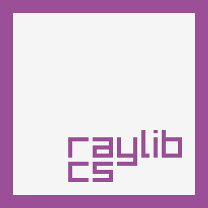

# Raylib-cs

C# bindings for raylib, a simple and easy-to-use library to learn videogames programming (www.raylib.com)

[](https://github.com/chrisdill/raylib-cs/graphs/contributors)

[](LICENSE)

[](https://discord.gg/raylib)

[](https://github.com/chrisdill/raylib-cs/stargazers)

[](https://github.com/chrisdill/raylib-cs/actions?query=workflow%3ABuild)

Raylib-cs targets net6.0 and uses the [official 5.0 release](https://github.com/raysan5/raylib/releases/tag/5.0) to build the native libraries.

## Installation - NuGet

This is the prefered method to get started.

1) Pick a folder in which you would like to start a raylib project. For example "MyRaylibCSProj".
2) Then from a terminal (for example a VSCode terminal), whilst in the directory you just created
    run the following commands. (Please keep in mind .NET should already be installed on your system)

```
dotnet new console
```
```
dotnet add package Raylib-cs
```

[](https://www.nuget.org/packages/Raylib-cs/)

If you need to edit Raylib-cs source then you will need to add the bindings as a project (see below).

If you are new to using NuGet (or you've forgotten) and are trying to run the above command in the command prompt,
remember that you need to be *inside the intended project directory* (not just inside the solution directory) otherwise
the command won't work.

## Installation - Manual

1. Download/clone the repo

2. Add [Raylib-cs/Raylib-cs.csproj](Raylib-cs/Raylib-cs.csproj) to your project as an existing project.

3. Download/build the native libraries for the platforms you want using the [official 5.0 release](https://github.com/raysan5/raylib/releases/tag/5.0).
   **NOTE: the MSVC version is required for Windows platforms**

4. Setup the native libraries so they are in the same directory as the executable/can be found in the [search path](https://www.mono-project.com/docs/advanced/pinvoke/).

6. Start coding!

## Hello, World!

```csharp
using Raylib_cs;

namespace HelloWorld;

class Program
{
    public static void Main()
    {
        Raylib.InitWindow(800, 480, "Hello World");

        while (!Raylib.WindowShouldClose())
        {
            Raylib.BeginDrawing();
            Raylib.ClearBackground(Color.White);

            Raylib.DrawText("Hello, world!", 12, 12, 20, Color.Black);

            Raylib.EndDrawing();
        }

        Raylib.CloseWindow();
    }
}
```

## Contributing

If you have any ideas, feel free to open an issue. If you'd like to contribute, please fork the
repository and make changes as you'd like. Pull requests are warmly welcome.

If you want to request features or report bugs related to raylib directly (in contrast to this binding), please refer to the [author's project repo](https://github.com/raysan5/raylib).

## License

See [LICENSE](LICENSE) for details.
